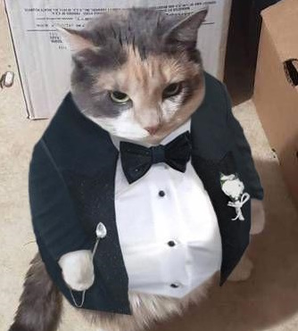

# **Karscoding Discord Bot**



*isn't he fancy?*

### General info

An open source Discord bot that has games and other commands.

This bot is open source to showcase what I've made and to also allow other people to use it as a source of learning.

### Documentation

Documentation is currently being worked on.

### Intention

The intention of this open source project is not for users to download it and launch it on their own
it's purely for users to look at the source code to see how it works.

### Setup

If you want to make it work anyway you will need to create a Token.java file in the kars.bot package.
This file must contain the following code where (token) is to be filled with
your own Discord app's token.

```java
public class Token {
    public static String getToken() {
        return (token);
    }
}
```
The function above is called in the main function and is not included
in the repository to ensure it is secure. I recommend you do the same by never
giving out your token.

### Credits

Everything in this project is originally made by me **Kars**, I'm a Software Engineering
student currently in my second year. I used this project to get better at Java and practice it.

This project uses **Java Discord API (JDA)** https://github.com/discord-jda/JDA .